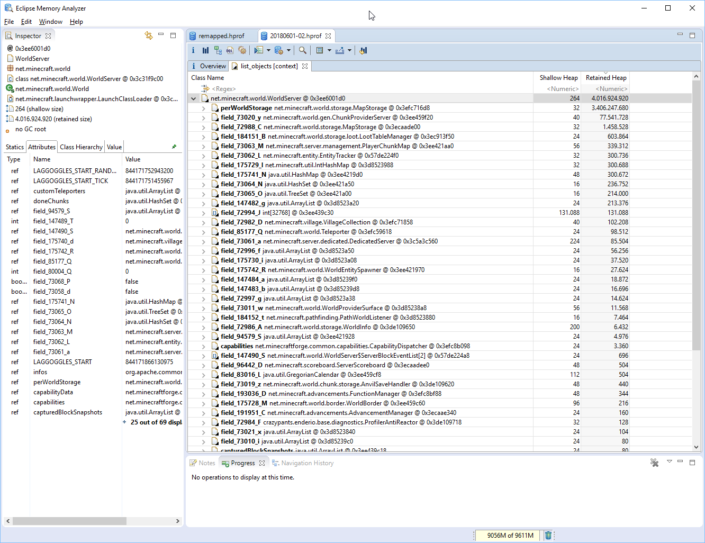
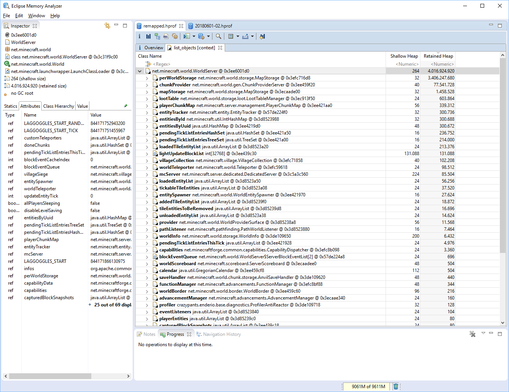

hprof remap [](https://circleci.com/gh/fraenkelc/hprof-remap)
============

hprof-remap is a changes fields and method names in hprof files from srg names to mcp names. 




## Usage
to run hprof-remap you'll need a matching mapping zip, for example from [MCPBot](http://export.mcpbot.bspk.rs/)

```text
Usage: bin/hprof-remap [options]
  Options:
    -h, --help
      shows this help message
  * -i
      location of the input file in hprof format
  * -m
      location of the mapping files. Must either be a directory containing 
      methods.csv and fields.csv or a zip file containing both. see 
      http://export.mcpbot.bspk.rs/ 
  * -o
      location of the output file in hprof format
```

Example invocation: 
```text
bin/hprof-remap -m mcp_snapshot-20180603-1.12.zip -i input.hprof -o output.hprof
```
